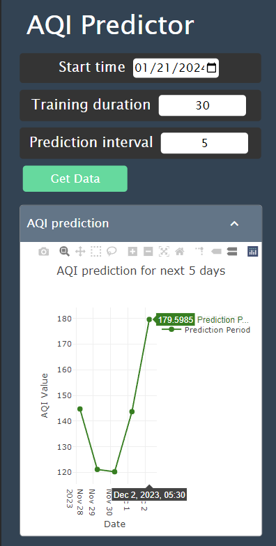

# AQI Predictor

AQI (Air Quality Index) predictor web app for forecasting AQI at your location in the given time interval using machine learning.

## Features

* Live forecast rendering
* Uses Prophet time series prediction model with Flask API
* Multiple prediction parameters like PM2.5, PM10, NO2, NH3, SO2, CO, OZONE
* Custom date, training interval and training time can be chosen
* Responsive UI

## Previews

### Preview 1 (Large screen)

### Preview 2 (Small screen)

## Future developments

Too occupied to work it on but always open to check issues, contribution pull requests and feedbacks